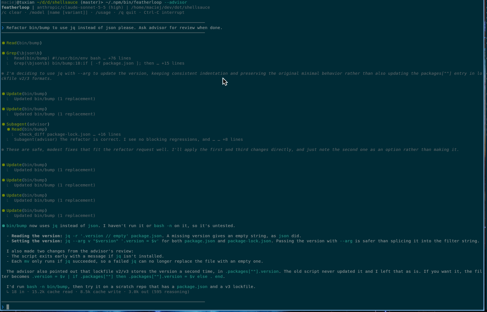

# featherloop
Minimal agent execution loop with configurable, context-lean toolsets.



featherloop is an agent harness designed to bring big possibilities to tiny models: (relatively) big results from
small amounts of memory and compute.

Features:
* advisor - let your model ask a higher-tier model for advice, and that one ask a higher-tier one still
* tool result compaction - summarize some tool results to keep the context short, with a smaller model if you like
* extremely small harness size
* compatible with Anthropic and OpenAI APIs; tested with llama.cpp
* MCP servers' tools, over stdio or HTTP, with no SDK
* under 4k lines of code, 75 kB package size

## Installation
```sh
npm -g i featherloop

```

## Usage
Featherloop still needs to be configured with your model preferances. Here's a minimalistic configuration example that gets you
talking to Sonnet 5.5, if you pass it an `ANTHROPIC_API_KEY`.

```yaml

model: anthropic/claude-opus-5-5
provider:
  anthropic:
    flavor: anthropic
    models:
      claude-opus-5-5:
        aliases:
          advisor: anthropic/claude-fable-5-1
        variants: *high_effort
      claude-sonnet-5-5:
        aliases:
          advisor: anthropic/claude-opus-5-5
        variants: *high_effort
      # Takes no effort setting.
      claude-haiku-4-5: {}

aliases:
  advisor: anthropic/claude-sonnet-5-5

```

MCP servers go under `mcp`, as in OpenCode. Their tools are named `<server>_<tool>`; each costs tokens on every turn,
so `tools` can pick the ones you want. featherloop speaks MCP 2026-07-28 only: older servers are left out with a warning.

```yaml
mcp:
  issues:
    type: remote
    url: https://mcp.example.com/mcp
    headers:
      Authorization: "Bearer {env:ISSUES_TOKEN}"
    tools: [search_issues, get_issue]
  files:
    type: local
    command: [npx, -y, some-mcp-server]
    environment:
      ROOT: /srv
```

## Motivation

It's the antithesis of tokenmaxxing, which I despise with all my heart, and for which I believe we'll pay a serious
environmental price. Beyond that, I've been hosting tiny models on my laptop and wanted to get the most out of them.

With model training moving so incredibly fast, it occurred to me that harnesses carry a lot of instruction models
have already learned in training, so I left it out. The success rates so far bear this out.

Heavily inspired by [OpenCode](https://opencode.ai) and [nanocode](https://github.com/1rgs/nanocode).
